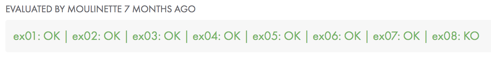

## Day 01 Exercises 

### Contents

	* Exercise 01 : print_groups
	* Exercise 02 : find_sh
	* Exercise 03 : count_files
	* Exercise 04 : MAC
	* Exercise 05 : Can you create it
	* Exercise 06 : Skip
	* Exercise 07 : r_dwssap
	* Exercise 08 : add_chelou

### Who did I do?

