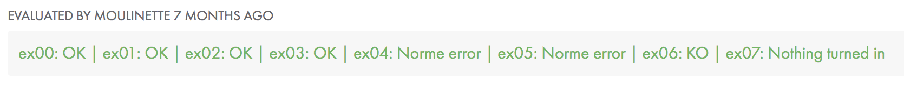

## Day 02 Exercises 

### Contents

```
  Ex 00 : ft_print_alphabet
  Ex 01 : ft_print_reverse_alphabet
  Ex 01 : ft_print_reverse_alphabet
  Ex 02 : ft_print_numbers
  Ex 03 : ft_is_negative
  Ex 04 : ft_print_comb
  Ex 05 : ft_print_comb2
  Ex 06 : ft_putnbr
  Ex 07 : ft_print_combn
```
  
### How did I do?



My score was `35/100`
